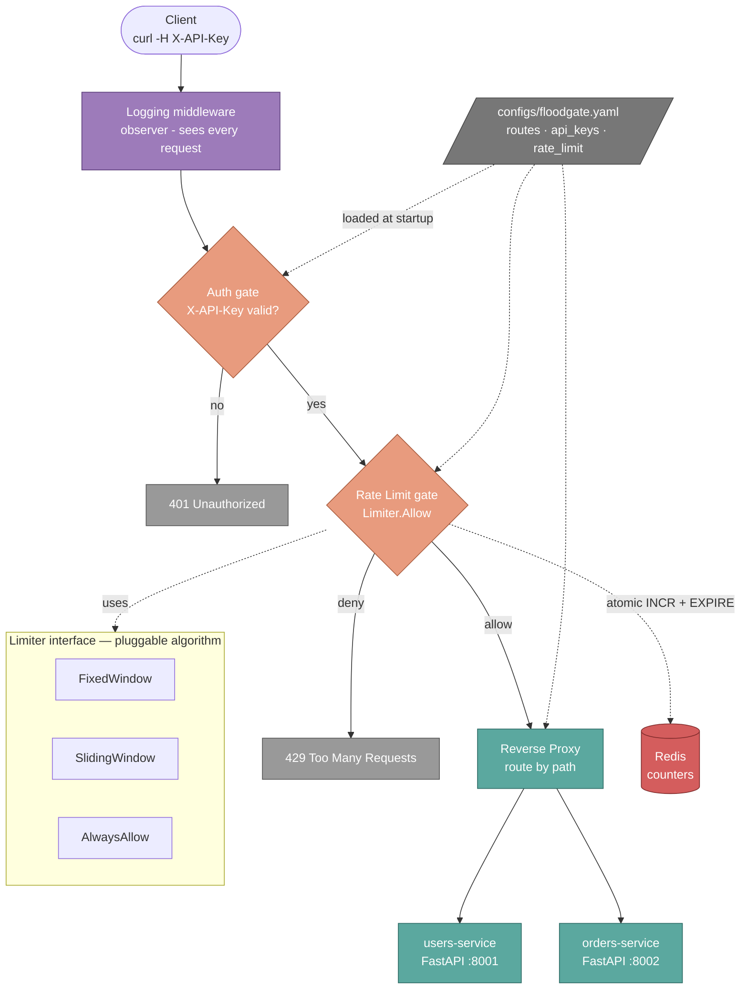

# Floodgate

> An adaptive API gateway that tightens when your backend strains.

Floodgate is a reverse proxy written in Go. It sits in front of backend services and handles authentication, request routing, structured logging, and rate limiting — protecting the backend from overload and from clients that misbehave. The reverse proxy also hides the backend's real address; clients only ever see Floodgate.

## Why this exists

Most rate limiters are static — you set a number and forget it. Floodgate is built around a different idea: the limit should react to what the backend is actually doing. v1 ships the foundation (auth, sliding-window and fixed-window rate limiting backed by Redis, logging middleware). v2 will add the adaptive controller that makes the rate limit *itself* a control system — watching backend health and tightening automatically when things look bad.

## Tech stack

| Layer | Tool | Why |
|---|---|---|
| Gateway | Go (`net/http`, `httputil.ReverseProxy`) | Native concurrency, low memory, designed for proxying |
| State | Redis | Atomic INCR + TTL for rate counters, sub-ms reads |
| Backends | FastAPI (Python) | Throwaway dummy services for routing demos |
| Orchestration | Docker Compose | One-command spin-up of the whole stack |
| Build | Multi-stage Docker + distroless | 22MB final gateway image |

## Architecture


## Quick start

```bash
git clone https://github.com/DexterDebugs/FloodGate.git
cd FloodGate
docker compose -f deploy/docker-compose.yml up --build
```

Then in another terminal:

```bash
# Allowed
curl -H "X-API-Key: dev-key-shanksss-001" localhost:8080/users/1

# Denied (no key)
curl -i localhost:8080/users/1

# Rate limited (after 10 requests in a minute)
for i in {1..12}; do
  curl -i -H "X-API-Key: dev-key-shanksss-001" localhost:8080/users/1 \
    2>/dev/null | head -1
done
```

The gateway listens on `localhost:8080`. Backends are internal-only and reached through the gateway.

## How it works

A request flows top-down through a chain of middleware before reaching the backend:

```
Client
  ↓
Logging (observer — sees every request including denials)
  ↓
Auth (gate — 401 on missing/invalid X-API-Key)
  ↓
Rate Limit (gate — 429 on deny, backed by Redis counters)
  ↓
Reverse Proxy (forwards to the right backend by path)
  ↓
Backend (users-service or orders-service)
```

The middleware uses the **observer-wraps-gate-wraps-handler** pattern. Logging is outermost so it captures every request — including the ones Auth or Rate Limit reject. Gates run in the middle and can short-circuit. The proxy is innermost and only runs if every gate passes.

Rate limiting hides behind a small interface:

```go
type Limiter interface {
    Allow(clientID, route string) bool
}
```

Three implementations live behind that interface: `AlwaysAllow` (no-op, used to test wiring), `FixedWindow` (single Redis bucket per window), and `SlidingWindow` (weighted two-bucket estimate that resists the boundary-burst attack fixed-window has). The algorithm is selected via YAML config — no code changes or recompile to swap.

## Configuration

`configs/floodgate.yaml`:

```yaml
rate_limit:
  algorithm: sliding_window   # or "fixed_window"
  limit: 10                   # max requests per window
  window_seconds: 60          # window duration

api_keys:
  - "dev-key-shanksss-001"

routes:
  - path: /users/
    target: http://users-service:8001
  - path: /orders/
    target: http://orders-service:8002
```

Bad config (unknown algorithm, missing fields) → the gateway refuses to start. Fail fast at startup beats failing mysteriously at runtime.

## Project structure

```
floodgate/
├── cmd/floodgate/         # entrypoint — wiring only
├── internal/
│   ├── auth/              # API key middleware (gate)
│   ├── config/            # YAML loader
│   ├── proxy/             # reverse proxy wrapper
│   ├── ratelimit/         # Limiter interface + 3 implementations + middleware
│   └── server/            # logging middleware (observer)
├── backends/              # FastAPI dummy services
├── configs/               # floodgate.yaml — routes, keys, limits
├── deploy/                # docker-compose.yml
└── Dockerfile             # multi-stage Go build (distroless final image)
```

## Roadmap

- [x] **v1** — working gateway with API key auth + Redis-backed rate limiting (fixed window + sliding window)
- [ ] **v2** — adaptive rate limiting driven by backend health (p95 latency + error rate)
- [ ] **v3** — observability dashboard with Prometheus + Grafana, plus k6 load tests
- [ ] **v4** — distributed mode (multiple gateway instances, atomic counters via Redis Lua scripts)